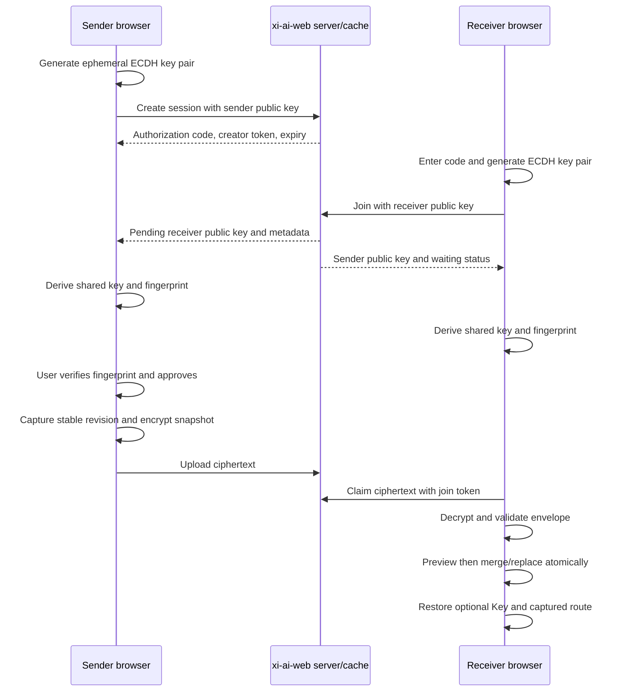

# Temporary-Code Progress Sync Design

## Architecture

The sender and receiver remain online for one short interactive session. The server coordinates the rendezvous and stores an opaque encrypted snapshot, while browsers perform key agreement, encryption, validation, and restore.



Because any device can choose `发送当前进度`, the same protocol covers desktop-to-phone and phone-to-desktop without separate directional APIs.

## Cryptographic Contract

### Key agreement

- Use Web Crypto ECDH with P-256 for broad modern browser support.
- Sender and receiver private keys are non-exported `CryptoKey` values held in memory only.
- Exchange only validated uncompressed public keys and random 128-bit nonces through the server.
- Derive the raw ECDH secret, then derive a 256-bit AES key with HKDF-SHA-256.
- HKDF salt and `info` bind protocol version, session ID, sender/receiver public keys, and both nonces.

### Fingerprint

- Hash the canonical handshake transcript with SHA-256.
- Display the same six decimal digits on both devices.
- The sender must click `确认并发送` after comparing the fingerprint. A mismatch requires cancellation and a new code.
- The server cannot substitute a public key unnoticed without changing the fingerprint.

### Payload encryption

- Build and validate `WorkspaceExportEnvelope` with existing code.
- Wrap it in `ProgressSyncPayload` containing protocol version, capture time, source revision, target path/module, selected model, inclusion flags, and optional UserProviderConfig.
- Optionally compress before encryption when the browser supports the approved compression path; the encrypted envelope records whether compression was used.
- Encrypt with AES-256-GCM and a fresh 96-bit IV. Bind protocol/session metadata as additional authenticated data.
- AES-GCM authentication and the existing workspace SHA-256 digest are both checked before preview.

The eight-character authorization code is not used for encryption. It only finds the short-lived session, while online limits and sender approval prevent guessed codes from granting access.

## Frontend Modules

- `src/features/workspace/progressSyncTypes.ts`: versioned payload, handshake, API, and state types.
- `src/features/workspace/progressSyncCrypto.ts`: ECDH/HKDF/AES-GCM, transcript canonicalization, fingerprint, encoding, size bounds, optional compression.
- `src/features/workspace/progressSyncClient.ts`: create/join/status/approve/upload/claim/reject/cancel calls.
- `src/app/TopBar.tsx`: icon-only global sync action beside workspace data and theme controls, with accessible hover/title text and Admin visibility gating.
- `src/features/workspace/ProgressSyncDialog.tsx`: dedicated modal shell, restore confirmations, optional-Key confirmation, and fragment-prefilled receive state.
- `src/features/workspace/ProgressSyncPanel.tsx`: reusable sender/receiver protocol UI rendered only inside the dedicated sync dialog.
- `src/features/workspace/ProgressSyncSender.tsx`: code, expiry, join request, fingerprint, API Key inclusion confirmation, capture/upload, status, cancel.
- `src/features/workspace/ProgressSyncReceiver.tsx`: code input, fingerprint, waiting/claim/decrypt, preview, merge/replace.
- `src/features/workspace/workspaceDb.ts`: add bounded `readWorkspaceRevision()`.
- `src/features/workspace/workspaceRepository.ts`: add stable capture and stale-preview guards while reusing existing export/restore.

Do not add a permanent public navigation menu item or consume workspace canvas height. Render one icon-only action in the desktop lower-left access toolbar and mobile header, beside workspace data and theme controls. Clicking it opens the dedicated dialog in send mode; direction changes remain inside the dialog. The QR is generated locally and encodes only `${window.location.origin}/chat#sync=<six-digits>`.

On bootstrap, parse `window.location.hash` only when it exactly matches `#sync=\d{6}`. Remove the fragment immediately with `history.replaceState`, then open the receive dialog with the code prefilled. If Admin disabled the feature, remove the fragment without opening the dialog.

## Versioned Payload

```ts
type ProgressSyncPayload = {
  schema: "xi-ai-web.progress-sync";
  version: 1;
  capturedAt: string;
  sourceRevision: number;
  workspace: WorkspaceExportEnvelope;
  resume: {
    path: string;
    moduleId: ModuleId;
    lastModelId: string;
  };
  session?: {
    userProvider?: UserProviderConfig;
  };
  inclusion: {
    workspace: true;
    apiKey: boolean;
    transientDrafts: false;
  };
};
```

The normal workspace export type remains credential-free. `session.userProvider` exists only in the encrypted progress-sync payload.

## Server Session State

```text
waiting_join
  -> awaiting_approval
  -> approved
  -> payload_ready
  -> claimed
  -> completed

Any non-terminal state -> rejected | cancelled | expired
```

Bounded metadata includes:

- random internal session ID
- hashed six-digit numeric code lookup value
- hashed creator/join tokens
- sender and receiver public keys/nonces
- state, attempts, timestamps, byte length
- opaque encrypted payload location

It excludes private keys, derived keys, plaintext workspace data, API Keys, cookies, and raw request bodies from logs.

## API Shape

- `POST /api/progress-sync/sessions`: create with sender public key/nonce; return code, creator token, expiry.
- `POST /api/progress-sync/sessions/join`: code plus receiver public key/nonce; return join token and sender public material.
- `POST /api/progress-sync/sessions/:id/status`: authenticated creator/join polling without query-string secrets.
- `POST /api/progress-sync/sessions/:id/approve`: creator approves the exact pending receiver transcript.
- `POST /api/progress-sync/sessions/:id/reject`: creator rejects the pending receiver.
- `POST /api/progress-sync/sessions/:id/payload`: creator uploads bounded ciphertext after approval.
- `POST /api/progress-sync/sessions/:id/claim`: receiver atomically claims ciphertext.
- `DELETE /api/progress-sync/sessions/:id`: creator or joined receiver cancels.

Mount dedicated small JSON parsers for handshake routes and a bounded raw parser for ciphertext before the global 2 MB parser. Reuse the established rate-limiter pattern but extract it into a shared server helper rather than duplicating Langflow's local implementation.

## Cache And Storage

### Default single instance

- In-memory state map for short-lived sessions.
- Opaque ciphertext files under `DATA_DIR/progress-sync`.
- Startup cleanup plus a periodic expiry sweep.
- Server restart invalidates active codes; UI states this clearly.

### Optional production mode

- Redis: session state, TTL, attempts, presence/status, and short claim locks.
- Persistent temporary volume or S3/COS: encrypted payload bytes.
- Redis loss may invalidate active codes but must not expose plaintext or corrupt browser workspaces.

Large ciphertext should not live only in Redis because memory eviction, restart, and TTL behavior make it unsuitable as the only payload store.

## Stable Snapshot And Restore

1. Wait for queued IndexedDB writes.
2. Read source `workspaceRevision`.
3. Read and validate snapshot, then read revision again.
4. If revisions differ, retry once or report that the workspace changed during capture.
5. Encrypt and upload only the stable snapshot.
6. Receiver records its local revision when preview begins.
7. Before apply, ensure receiver revision is unchanged; otherwise regenerate preview.
8. Suspend writes and reuse atomic merge/replace.
9. Only after workspace success, persist optional API Key to `sessionStorage`.
10. Navigate to captured route and complete the one-time session.

## UI Contract

### Sender

- Select included stable data and optional API Key.
- API Key starts unchecked; enabling opens a second confirmation.
- Desktop sender displays a locally generated QR, six-digit fallback code, expiry countdown, copy action, and `等待手机扫码`.
- Mobile sender displays the six-digit code for entry on desktop and does not ask the phone to scan its own screen.
- On join, display browser/device hint and six-digit fingerprint with `确认并发送` / `拒绝`.
- Keep the page open until completion; refresh/close invalidates the code.

### Receiver

- Enter/paste exactly six decimal digits. QR handoff prefills the same field but does not auto-join; the receiver explicitly confirms.
- Display the same fingerprint and wait for sender approval.
- After decrypt/validation, show counts, captured time, source revision, target module, transfer size, and masked optional Key.
- Default merge; replace requires shared destructive confirmation.

Both flows require 44px touch targets, clear focus order, status live regions, dark/light support, reduced motion, and mobile safe-area containment.

## Operational Limits

- Code TTL: default 10 minutes, configurable 3-30.
- Authorization code: exactly six decimal digits generated without modulo bias.
- Join attempts: recommended five per IP per window and five per session before invalidation.
- Ciphertext: default 32 MB, Admin-configurable 5-64 MB.
- One pending receiver and one successful payload/claim per session.
- All responses `Cache-Control: no-store`; no secrets in URLs or logs.
- HTTPS is required outside localhost because Web Crypto and secrecy depend on a secure origin.

## Rollback

- Disable `PROGRESS_SYNC_ENABLED` to hide the panel and reject new sessions.
- Existing workspace export/import remains unchanged.
- Removing expired opaque payload files cannot modify browser workspaces or Admin metadata.

## Reverse QR Transfer Extension - 2026-08-04

### Chosen Boundary

Generalize the existing progress-sync session with an explicit semantic creator role instead of adding a second invitation cache. `creatorRole` is `sender` by default for backward compatibility or `receiver` for desktop `从手机同步` QR sessions. The joining role must be the exact complement.

- Existing desktop-to-phone: desktop creates as semantic sender; phone joins as semantic receiver.
- Reverse phone-to-desktop: desktop creates as semantic receiver; phone scans `#sync-send=<code>` and joins as semantic sender.
- Creator/joiner are transport roles only. Authorization is always resolved to semantic sender/receiver before approve, reject, upload, claim, status projection, or cancellation.
- Semantic sender alone may approve the receiver material, reject, and upload ciphertext.
- Semantic receiver alone may claim ciphertext and restore the workspace.
- Either authenticated side may cancel.

### Compatibility Contract

- Missing `creatorRole` means `sender`; existing create body `{ sender }` and join body `{ receiver }` remain valid.
- Legacy `#sync=<six-digits>` still opens receive mode.
- New exact fragment `#sync-send=<six-digits>` opens phone send mode with the rendezvous code in memory.
- Both fragments are removed immediately with `history.replaceState` before rendering the dialog.
- QR/code possession never auto-joins, captures, encrypts, uploads, claims, or restores.

### Reverse Flow

1. Desktop receive mode generates receiver ECDH material and creates a session with `creatorRole: receiver`.
2. Desktop renders the local QR and six-digit fallback code, then polls as semantic receiver.
3. Phone scans the QR, clears the fragment, opens send mode, and explicitly confirms sending current progress.
4. Phone captures a stable snapshot, generates sender material, and joins the receiver-created session as semantic sender.
5. Both devices derive the canonical transcript in `sender, receiver` order and show the same fingerprint.
6. Phone explicitly approves and uploads; desktop claims, decrypts, previews, and explicitly merges or replaces.

### Risk Controls

- Store `creatorRole` in the session and derive each authenticated token's semantic role; never infer upload/claim authority from token field names.
- Reject same-role joins, conflicting body fields, malformed role values, approval by receiver, upload by receiver, and claim by sender before side effects.
- Keep receiver material hash binding independent of which side created it.
- Preserve the six-digit code attempt limits, one pending peer, TTL, no-store headers, constant-time token checks, single upload, and atomic claim.
- The new QR contains only same-origin route, direction marker, and six digits. It contains no role token, key material, nonce, payload, API Key, or session ID.

## Stable Dialog Geometry - 2026-08-04

### Problem

The current dialog has only a width and maximum-height contract. Its actual height is content-driven: the sender idle view includes the API Key option while the receiver QR view ends with a lightweight method-switch link. Switching the top-level direction therefore resizes and recenters the entire dialog.

### Chosen Structure

- Desktop `.progress-sync-dialog` is a stable two-row shell: fixed header and a bounded content viewport.
- `.progress-sync-dialog-body` owns vertical overflow with `min-height: 0`; the outer `.ui-dialog` does not grow per tab state.
- `.progress-sync-section` is a two-row internal shell: stable direction tabs and a flexible tab panel viewport.
- Sender and receiver idle panels share three semantic slots: instruction, secondary option, and primary action.
- Sender secondary content is API Key inclusion. Receiver secondary content is the receive-method selector and, when selected, the bounded authorization-code entry.
- Runtime protocol states reuse the same panel viewport. QR, fingerprint, preview, error, and completion content may scroll inside it without moving the shell.

The exact desktop height is selected only after browser measurement of both accepted desktop viewports and the tallest normal state. CSS must use a viewport cap rather than an unconstrained fixed pixel height.

### Responsive Contract

- At desktop widths, direction changes preserve the dialog, header, close button, tabs, and content viewport bounding boxes within `1px`.
- Below `1024px`, use viewport-bounded maximum height and an equalized idle panel minimum height rather than the desktop fixed-height value.
- `visualViewport`/soft-keyboard changes may reduce available height, but only the dialog body scrolls; the active field and close action remain reachable.
- No geometry property is animated. Optional content transition is opacity plus at most `4px` translation for `120-160ms`, removed under reduced motion.

### Compatibility

This is a presentation-only change. It does not alter session roles, API requests, six-digit codes, QR fragments, ECDH transcript order, encrypted payloads, API Key policy, restore behavior, or Admin gating.
