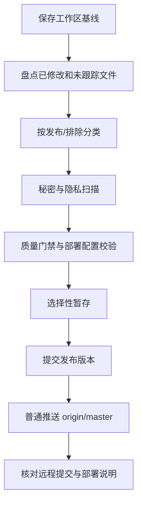

# GitHub 发布与服务器部署设计

## 发布对象

以当前工作区为 source of truth，先将文件分为四类：

1. **发布代码**：`src/`、`server/`、`public/`、`index.html`、`vite.config.ts`、类型与测试脚本。
2. **发布运维资料**：`Dockerfile`、`deploy/app/`、主 README、部署清单、必要的 `package.json`/`package-lock.json`。
3. **可审计项目记录**：当前有效的 `plans/`、`.trellis/spec/` 和已形成决策的 `.trellis/tasks/` 文件；运行时状态、个人会话日志和临时目录不纳入。
4. **禁止发布内容**：`.env*` 中的真实运行文件、`data/`、`dist/`、`reports/`、`node_modules/`、浏览器工作区、日志、令牌和服务器凭据。

## 审计流程

不直接使用无审计的 `git add .`。优先使用已确认的发布路径选择性暂存，再用 `git diff --cached` 检查 staged 内容、二进制文件和敏感文本。

## Git 安全边界

- 推送前执行 `git fetch origin`，确认远程没有新的不可合并提交。
- 若远程只包含本地已知历史，创建单一发布提交；已有本地提交继续保留。
- 只允许普通 fast-forward push 到 `origin/master`。远程分叉、权限错误、代理失败或 hook 拒绝时停止，不使用 `--force`。
- 记录发布 commit、父提交、远程 HEAD 和最终 `git status --short`。
- 不覆盖用户未提交修改；若发布分类发现不确定文件，保留在工作区并在报告中列明。

## 部署契约

根目录 `docker-compose.yml` 只消费 `ghcr.io/xiziqiwuyou/xi-ai-web` 预构建镜像。镜像由 GitHub Actions 从仓库 `Dockerfile` 构建并发布；服务器不持有源码、不执行 `docker build`，运行时只需要 Compose 与 `.env`。部署必须保持：

- `UPSTREAM_BASE_URL=https://api.xi-ai.cn`；用户请求 URL 不进入生产发布配置。
- `ADMIN_USERNAME=xizi2333` 和强 `ADMIN_PASSWORD`。
- `DATA_DIR=/app/data` 映射持久卷。
- `KNOWLEDGE_ENABLED=false`、`LANGFLOW_ENABLED=false`、`PROGRESS_SYNC_ENABLED=false` 作为首发默认值。
- `127.0.0.1:8787` 仅供反向代理访问，外部通过 HTTPS 暴露。
- Compose 健康检查访问 `/api/ready`，反代关闭 SSE 缓冲并设置足够的请求体/超时。
- 主应用、知识库迁移和知识库 Worker 使用同一 `XI_AI_WEB_IMAGE`，避免代码版本漂移。
- `latest` 跟随 `master`，同时发布 `sha-<commit>` 和 `v*` 版本标签，为生产锁定与回滚提供不可变入口。
- GHCR 默认私有时不宣称可匿名部署；文档必须给出将 Package 设为 Public 的一次性操作和 Private Package 的 PAT 登录替代方案。

## 回滚

推送前任何审计失败都只停留在本地，不改远程。推送后部署回滚使用上一发布 commit 或上一镜像，保留同一 `/app/data` 数据卷；不回滚或覆盖管理员运行时密钥。
