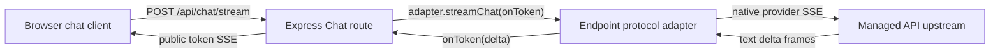

# Native Provider Chat Streaming Design

## Boundary

The public Chat route already streams its own server-sent events and the browser
already consumes them incrementally. This task changes the provider-adapter
boundary only, plus the response-header flush and reverse-proxy documentation.

## Shared Parser

`server/providers/types.mjs` owns a small SSE frame consumer. It reads the
WHATWG `ReadableStream`, preserves incomplete UTF-8/frame tails, supports
multiple `data:` lines, ignores comments, and passes `{ event, data }` records
to a caller. It has no provider-specific JSON or event assumptions.

Existing OpenAI-compatible Chat streaming will use this parser too, removing
duplicate line-buffer code without changing its event semantics.

## Provider Contracts

| Protocol | Request | Text event | Completion / usage |
| --- | --- | --- | --- |
| OpenAI Responses | `POST /responses`, JSON `stream: true` | `response.output_text.delta`, field `delta` | `response.completed`, nested `response.usage` |
| Anthropic Messages | `POST /messages`, JSON `stream: true` | `content_block_delta`, `delta.type === text_delta`, field `delta.text` | `message_delta`, nested `usage` |
| Gemini Generate Content | `POST ...:streamGenerateContent?alt=sse` | each event candidate text | terminal / final event may repeat accumulated text |

For Gemini, some gateways emit full cumulative candidate text instead of a pure
suffix. The adapter keeps the prior candidate string and emits only the unseen
suffix; divergent text is forwarded as-is rather than discarded.

Tool-bearing requests keep their existing non-streaming tool-loop behavior.
The ordinary no-tool path uses native provider streaming.

## Error And Compatibility Behavior

- Non-2xx provider responses remain bounded error messages.
- A non-SSE success body is read as bounded JSON and parsed using existing
  helpers; a recognized text response is returned as one final token.
- Malformed provider SSE JSON fails the request rather than being exposed as
  ordinary chat text. A completed provider response may still legitimately have
  no displayable text (for example a provider safety refusal).
- The public Chat route flushes its headers before the `meta` event. Existing
  heartbeat, abort, redaction, and terminal `done` behavior remains intact.

## Rollout

Release a new immutable patch image tag (do not overwrite `v0.0.1`). In 1Panel,
place the dedicated `/api/chat/stream` location before the generic `/` location,
reload OpenResty, then validate with a disposable user Key outside this source
tree.
