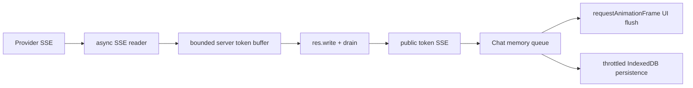

# Stable Chat Streaming Design

## Scope

The change spans Provider SSE readers, the Express Chat route, the frontend Chat
coordinator, and deployment configuration. It does not change provider request
formats, catalog routing, the BYOK boundary, or tool execution semantics.

## Server Token Buffer

`createSseTokenBuffer` owns a string queue and a single flush timer. It uses a
short cadence (`SSE_TOKEN_FLUSH_MS`, default 32ms), a maximum wait
(`SSE_TOKEN_MAX_WAIT_MS`, default 80ms), and a bounded batch size
(`SSE_TOKEN_MAX_CHARS`, default 512). The first token starts the timer without a
full-response delay. `finish`, `fail`, `cancel`, and queue threshold paths flush
or reject deterministically.

`writeSse` writes one complete SSE event string. `writeSseWithBackpressure`
waits for `drain` when Node returns `false`, aborts on a bounded
`SSE_BACKPRESSURE_TIMEOUT_MS`, and rejects if pending text exceeds
`SSE_TOKEN_MAX_QUEUE_CHARS`.

## Async Provider Callbacks

The shared `consumeSseEvents` helper awaits `onEvent`. Provider stream adapters
await `onToken` for native no-tool streaming. Tool-loop fallback remains a single
final callback. This makes backpressure travel from the response socket to the
upstream reader instead of allowing a fast provider to outrun a slow client.

## Browser Rendering And Persistence

`ChatModule` keeps an in-memory per-stream accumulator and schedules one React
state flush per animation frame. It persists at most once per bounded interval
(`STREAMING_PERSIST_INTERVAL_MS`, default 300ms) and always flushes on `done`,
`error`, or stop. The accumulator is authoritative for the current assistant
message, so stale closures cannot drop a token. `streamOutput=false` still uses
the terminal message as the source of truth.

## Failure Semantics

- A long provider silence produces no invented text.
- A malformed provider event still fails the existing Chat request.
- A downstream disconnect aborts the upstream request and prevents further SSE.
- A queue overflow or drain timeout fails the request with a bounded public error;
  it never allocates unbounded memory.
- No token is emitted after `done`, `error`, cancellation, or a settled stream.

## Rollout

Defaults are conservative and require no UI or environment changes. Operators can
tune bounded server variables through deployment configuration. Existing Nginx or
OpenResty SSE no-buffer settings remain required; application micro-buffering is
not a replacement for proxy configuration.
