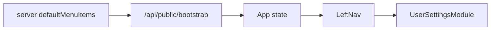

# Phase 01 - 公共设置菜单与设置模块

## Overview

日期：2026-05-23  
状态：Planned  
优先级：P0  

新增普通用户侧“设置”模块，让左侧菜单可以进入 API 配置页面。此阶段只建立入口和页面结构，不改调用流程。

## Key Insights

- `ModuleId` 目前没有 `settings`，需要先扩展类型。
- `GenerationModuleId = Exclude<ModuleId, "chat" | "assistants">`，新增 `settings` 后必须排除，否则设置页会被误当作生成模块。
- `defaultMenuItems()` 会被 `normalizeData()` 用来补齐旧数据，所以只要默认菜单加入 `settings`，旧 `data/app-data.json` 启动后也能得到新菜单项。
- 这是普通用户设置，不是后台设置。文案避免“系统设置、后台、管理员、菜单开关”等词。

## Requirements

- 左侧菜单新增“设置”按钮。
- “设置”在普通首页可见，可由管理员通过现有后台菜单开关隐藏或禁用。
- `/admin` 继续作为独立管理员后台入口。
- 设置页只展示用户自己的模型接入配置。

## Architecture



## Related Code Files

- Modify: `C:\Users\56252\Documents\New project 2\src\types.ts`
  - Add `"settings"` to `ModuleId`.
  - Update `GenerationModuleId` to exclude `"settings"`.
- Modify: `C:\Users\56252\Documents\New project 2\server\index.mjs`
  - Add `{ id: "settings", label: "设置", enabled: true, visible: true, order: 80 }` to `defaultMenuItems()`.
- Modify: `C:\Users\56252\Documents\New project 2\src\app\moduleRegistry.tsx`
  - Import `Settings2` or `SlidersHorizontal` from `lucide-react`.
  - Add `settings` metadata.
- Modify: `C:\Users\56252\Documents\New project 2\src\app\ModuleRouter.tsx`
  - Route `activeModule === "settings"` to a new settings page.
- Create: `C:\Users\56252\Documents\New project 2\src\features\settings\UserSettingsModule.tsx`
  - Render settings UI shell and form fields.

## Implementation Steps

1. Extend `ModuleId`.
2. Fix `GenerationModuleId`:

```ts
export type GenerationModuleId = Exclude<ModuleId, "chat" | "assistants" | "settings">;
```

3. Add `settings` to server default menu.
4. Add `settings` metadata:

```ts
settings: {
  label: "设置",
  title: "设置",
  description: "统一配置模型接入",
  highlights: ["API URL", "API Key", "默认模型"],
  icon: Settings2
}
```

5. Create `UserSettingsModule`.
6. Route settings before generation fallback:

```tsx
if (activeModule === "settings") {
  return <UserSettingsModule ... />;
}
```

## Todo List

- [ ] Add `settings` module type.
- [ ] Add default menu item.
- [ ] Add module registry metadata.
- [ ] Add settings module file.
- [ ] Route settings module.

## Success Criteria

- 左侧菜单出现“设置”。
- 点击“设置”进入用户模型接入页面。
- “设置”不会进入 `GenerationModule`。
- 管理员后台入口仍只通过 `/admin` 访问。

## Risk Assessment

- Risk: 新增 `ModuleId` 导致 `Record<ModuleId, ...>` 编译失败。
  - Mitigation: 同步更新 `moduleRegistry`。
- Risk: 旧数据没有新菜单。
  - Mitigation: 依赖 `normalizeData()` 以默认菜单补齐。

## Security Considerations

- 此阶段只做 UI 壳，不处理持久化。
- 设置页文案明确 API Key 仅用于当前浏览器调用，不出现后台管理误导。

## Next Steps

进入 Phase 02，加入共享状态与浏览器会话持久化。
