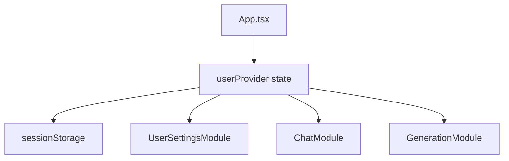

# Phase 02 - 统一用户 API 配置状态

## Overview

日期：2026-05-23  
状态：Planned  
优先级：P0  

把 API URL、API Key、默认模型从各功能模块中抽到应用顶层，形成全局 `UserProviderConfig`。设置页负责修改它，功能页只读取它。

## Key Insights

- 已有类型 `UserProviderConfig` 可复用。
- 后端已有 `transientProvider` 请求结构，不需要新增数据库字段。
- 用户 API Key 不应该保存到服务端。
- `sessionStorage` 是当前阶段的低风险默认值。

## Requirements

- 全局统一配置字段：
  - `providerName`
  - `baseUrl`
  - `apiKey`
  - `model`
- 设置页可以更新配置。
- 配置刷新页面后在当前浏览器会话内保留。
- API Key 不写入 `data/app-data.json`。
- 所有模块能知道配置是否完整。

## Architecture



## Related Code Files

- Create: `C:\Users\56252\Documents\New project 2\src\features\settings\userProviderConfig.ts`
  - Default config.
  - `loadUserProviderConfig()`.
  - `saveUserProviderConfig()`.
  - `isUserProviderReady()`.
  - `sanitizeUserProviderConfig()`.
- Modify: `C:\Users\56252\Documents\New project 2\src\App.tsx`
  - Add `userProvider` state.
  - Persist to `sessionStorage`.
  - Pass state/actions into `ModuleRouter`.
- Modify: `C:\Users\56252\Documents\New project 2\src\app\ModuleRouter.tsx`
  - Accept `userProvider`, `onUserProviderChange`, `onNavigateSettings`.
- Modify: `C:\Users\56252\Documents\New project 2\src\features\settings\UserSettingsModule.tsx`
  - Bind form fields to shared config.

## Implementation Steps

1. Create helper module:

```ts
export const defaultUserProviderConfig: UserProviderConfig = {
  providerName: "自带模型",
  baseUrl: "https://api.openai.com/v1",
  apiKey: "",
  model: "gpt-4.1-mini"
};
```

2. Add safe load:

```ts
export function loadUserProviderConfig(): UserProviderConfig {
  try {
    const raw = sessionStorage.getItem(storageKey);
    return raw ? sanitizeUserProviderConfig(JSON.parse(raw)) : defaultUserProviderConfig;
  } catch {
    return defaultUserProviderConfig;
  }
}
```

3. Add top-level state in `App.tsx`:

```tsx
const [userProvider, setUserProvider] = useState(loadUserProviderConfig);
const updateUserProvider = useCallback((patch: Partial<UserProviderConfig>) => {
  setUserProvider((current) => sanitizeUserProviderConfig({ ...current, ...patch }));
}, []);
```

4. Persist on change:

```tsx
useEffect(() => {
  saveUserProviderConfig(userProvider);
}, [userProvider]);
```

5. Pass props through `ModuleRouter`.
6. Settings page updates shared state only.

## Todo List

- [ ] Create config helper.
- [ ] Add state in `App.tsx`.
- [ ] Persist to `sessionStorage`.
- [ ] Pass config into router.
- [ ] Bind settings form.

## Success Criteria

- 设置页修改 API URL/Key/模型后，切到聊天或画图页面可立即使用同一配置。
- 刷新页面后当前会话配置仍在。
- 服务端数据文件不包含用户输入的 API Key。

## Risk Assessment

- Risk: `sessionStorage` 在隐私模式或禁用场景报错。
  - Mitigation: helper 使用 `try/catch`，失败时只保留内存状态。
- Risk: API Key 输入误清空。
  - Mitigation: 设置页提供明确保存状态提示，但不自动请求验证。

## Security Considerations

- 不把 API Key 发送到任何配置保存接口。
- 不在控制台打印 API Key。
- 不把 API Key 显示为明文，默认使用 password input，并提供显隐切换。

## Next Steps

进入 Phase 03，移除模块内重复配置，把请求统一改为共享配置。
