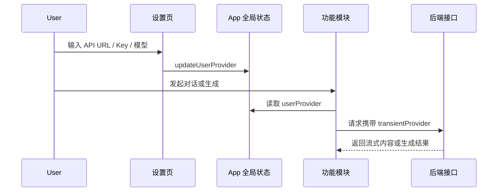

# Phase 03 - 改造聊天与生成调用流程

## Overview

日期：2026-05-23  
状态：Planned  
优先级：P0  

聊天、画图、音频、视频、智能体、知识库都改为读取顶层 `userProvider`。功能页不再出现独立 API URL / API Key 表单，只保留业务输入、结果展示和跳转设置的轻提示。

## Key Insights

- 当前聊天模块的 `ChatHeader` 内有连接弹窗。
- 当前生成模块页面内有“模型接入”区域。
- 两处重复维护配置会导致用户困惑，也会出现不同模块使用不同 Key 的隐性 bug。
- 请求 payload 已经接受 `transientProvider`，所以改造集中在前端数据来源。

## Requirements

- 聊天发送消息时使用共享配置。
- 生成类模块提交任务时使用共享配置。
- 未配置完整时：
  - 禁用提交按钮或阻止提交。
  - 显示“去设置”按钮。
  - 点击后切换到左侧“设置”模块。
- 聊天头部不再弹出 API URL/Key 输入框。
- 生成页面不再显示独立模型接入表单。

## Architecture



## Related Code Files

- Modify: `C:\Users\56252\Documents\New project 2\src\features\chat\ChatModule.tsx`
  - Remove local `defaultUserProvider`, `userProvider`, `connectionOpen`, `updateUserProvider`.
  - Accept shared `userProvider`.
  - Replace connection popover with compact status pill and “去设置” action.
- Modify: `C:\Users\56252\Documents\New project 2\src\features\generation\GenerationModule.tsx`
  - Remove `defaultProvider`, local `provider`, `updateProvider`, model接入表单。
  - Accept shared `userProvider`.
  - Use shared `isUserProviderReady()`.
- Modify: `C:\Users\56252\Documents\New project 2\src\app\ModuleRouter.tsx`
  - Pass `userProvider` into `ChatModule` and `GenerationModule`.
  - Pass `onNavigateSettings={() => onModuleChange("settings")}`.
- Modify: `C:\Users\56252\Documents\New project 2\src\App.tsx`
  - Pass `onModuleChange` or specific `onNavigateSettings` into `ModuleRouter`.

## Implementation Steps

1. Update `ModuleRouterProps`:

```ts
userProvider: UserProviderConfig;
onUserProviderChange: (patch: Partial<UserProviderConfig>) => void;
onModuleChange: (moduleId: ModuleId) => void;
```

2. Chat module props:

```ts
type ChatModuleProps = {
  userProvider: UserProviderConfig;
  onNavigateSettings: () => void;
  ...
};
```

3. Chat send flow:

```ts
if (!isUserProviderReady(userProvider)) {
  setNotice({ tone: "bad", message: "请先在设置中完成模型接入" });
  onNavigateSettings();
  return;
}
```

4. Generation module props:

```ts
type GenerationModuleProps = {
  userProvider: UserProviderConfig;
  onNavigateSettings: () => void;
  ...
};
```

5. Generation submit flow uses:

```ts
transientProvider: {
  providerName: userProvider.providerName,
  baseUrl: userProvider.baseUrl.trim(),
  apiKey: userProvider.apiKey.trim(),
  model: userProvider.model.trim()
}
```

6. Remove duplicate API credential input UI from feature pages.

## Todo List

- [ ] Refactor `ChatModule` props and request payload.
- [ ] Replace chat connection popover with status/action.
- [ ] Refactor `GenerationModule` props and request payload.
- [ ] Remove generation connection form.
- [ ] Add common unconfigured state.

## Success Criteria

- 在设置页填一次 API URL/Key/模型，聊天和所有生成模块都能用。
- 不在聊天页或画图页重复看到 API Key 输入框。
- 未配置时，功能页能清楚引导去“设置”。
- 请求 payload 仍包含 `transientProvider`，后端无需保存用户 Key。

## Risk Assessment

- Risk: 功能页跳转设置后用户输入内容丢失。
  - Mitigation: 只在提交时阻止，当前页面 draft state 保留在组件未卸载前；如要更强体验，后续再做草稿持久化。
- Risk: 不同生成类型默认模型不同。
  - Mitigation: 当前阶段采用统一默认模型；需要专用模型时，让用户在设置页改默认模型。后续可做“按功能覆盖模型”。

## Security Considerations

- 请求时只发送到本应用后端，由后端代理调用目标 API。
- 不把 API Key 写进管理员 provider 列表。
- UI 不展示完整 Key，只显示连接状态。

## Next Steps

进入 Phase 04，做构建、接口和浏览器验收。
