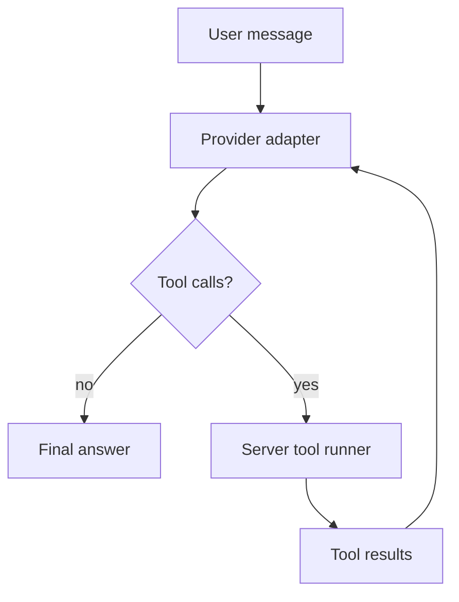

# Phase 03 - 对话、多模态与工具调用

## Overview

Status: Planned  
Priority: P0  

把聊天请求从纯文本升级为 message parts，并在服务端实现工具调用循环。

## Related Files

- Modify: `C:\Users\56252\Documents\New project 2\src\types.ts`
- Modify: `C:\Users\56252\Documents\New project 2\src\api.ts`
- Modify: `C:\Users\56252\Documents\New project 2\src\features\chat\ChatModule.tsx`
- Create: `C:\Users\56252\Documents\New project 2\server\tools\registry.mjs`
- Create: `C:\Users\56252\Documents\New project 2\server\tools\runner.mjs`
- Modify: `C:\Users\56252\Documents\New project 2\server\index.mjs`

## Requirements

- Chat supports text + image attachments.
- Later extensible to audio/file attachments.
- Tools are registered server-side only.
- Provider tool calls are normalized into one internal shape.
- Max tool rounds to prevent loops.

## Tool Loop



## Internal Tool Schema

```ts
type InternalTool = {
  name: string;
  description: string;
  inputSchema: JSONSchema;
  execute: (input, context) => Promise<ToolResult>;
};
```

## Initial Tools

- `knowledge.search`
  - used by RAG.
- `datetime.now`
  - low-risk system tool.
- `calculator.eval`
  - optional, strict expression parser only.

Do not add arbitrary shell or HTTP browsing tools in MVP.

## Provider Mapping

### OpenAI

- Tools map to Responses function tools.
- Tool calls normalize from response output items.
- Tool outputs sent back as follow-up input items.

### Anthropic

- Tools map to top-level `tools`.
- Tool calls are `tool_use` content blocks.
- Results return as user `tool_result` blocks.

### Gemini

- Tools map to `functionDeclarations`.
- Calls are `functionCall` parts.
- Results return as `functionResponse` parts.

## Streaming Strategy

MVP:

- If tools are enabled, run non-streaming tool rounds.
- Stream only final answer.

Reason:

- Provider stream event shapes are different.
- Tool call chunks make UI state harder.
- Non-streaming tool rounds are simpler and reliable.

Later:

- Add SSE events:
  - `tool_call`
  - `tool_result`
  - `reasoning_status`

## Success Criteria

- Text chat works for OpenAI, Claude, Gemini.
- Image input works for OpenAI, Claude, Gemini.
- One internal tool definition can be used by all three providers.
- Tool loop stops after configured max rounds.

## Security

- Tool registry allow-list only.
- Tool input schema validation.
- Max rounds: 4.
- Per tool timeout: 20s.
- No user-controlled tool names beyond model requested registered tools.
