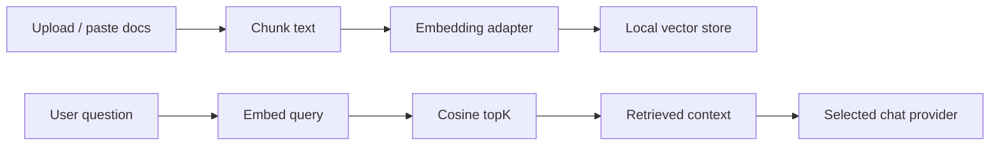

# Phase 05 - 向量检索与知识库

## Overview

Status: Planned  
Priority: P1  

实现 provider-neutral RAG。OpenAI/Gemini 提供 embedding；Claude 使用检索后的上下文。后续可接 OpenAI/Gemini 原生 file search。

## Related Files

- Create: `C:\Users\56252\Documents\New project 2\server\knowledge\chunkText.mjs`
- Create: `C:\Users\56252\Documents\New project 2\server\knowledge\vectorStore.mjs`
- Create: `C:\Users\56252\Documents\New project 2\server\knowledge\retrieval.mjs`
- Modify: `C:\Users\56252\Documents\New project 2\server\providers\openai.mjs`
- Modify: `C:\Users\56252\Documents\New project 2\server\providers\gemini.mjs`
- Modify: `C:\Users\56252\Documents\New project 2\server\providers\anthropic.mjs`
- Modify: `C:\Users\56252\Documents\New project 2\server\index.mjs`
- Modify: `C:\Users\56252\Documents\New project 2\src\features\generation\GenerationModule.tsx`

## MVP Storage

Use local files under:

```txt
data/knowledge/
  documents.json
  chunks.jsonl
  vectors.jsonl
```

Reason:

- No database dependency.
- Easy server deployment.
- Good enough for small self-hosted knowledge bases.

Future:

- SQLite + vector extension.
- Postgres + pgvector.
- Provider-native file search.

## Data Model

```ts
type KnowledgeChunk = {
  id: string;
  documentId: string;
  text: string;
  metadata: Record<string, string>;
  embeddingProvider: ProviderKind;
  embeddingModel: string;
  vector: number[];
};
```

## Retrieval Flow



## Provider Behavior

### OpenAI

- Use native embeddings.
- Optional later: vector stores + file_search.

### Gemini

- Use native embeddings.
- Optional later: Gemini file search / semantic retrieval.

### Claude

- No native Anthropic embedding model in official docs.
- Use OpenAI/Gemini embedding adapter.
- Claude receives retrieved chunks as context.

## Implementation Steps

1. Add `embedText()` to provider adapter contract.
2. Implement OpenAI embeddings.
3. Implement Gemini embeddings.
4. Anthropic `embedText()` returns capability error.
5. Add local chunking and vector store.
6. Add `knowledge.search` tool.
7. Update knowledge module to:
   - index context if pasted/uploaded.
   - retrieve top chunks.
   - call chat provider with citations/context.

## Success Criteria

- User can index text content.
- Query returns top relevant chunks.
- Any chat provider can answer with retrieved context.
- Claude works with RAG through external embeddings.

## Security

- File size limits.
- Text extraction allow-list.
- No indexing of API keys or secret-looking content by default if detected.
- Local data stays in `data/knowledge`.
