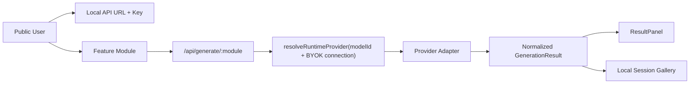

# Phase 04 - Core Feature Modules

## Overview

Date: 2026-05-29  
Status: Completed  
Priority: P1

Turn every visible public menu item into a usable module, while keeping the existing BYOK boundary:

- Public user provides API URL + API Key at request time.
- Backend resolves only model catalog metadata.
- Backend does not persist public API URL or API Key.
- Admin feature expansion remains Phase 05.

## Current Findings

- `ppt`, `apps`, `mindmap`, and `gallery` are still placeholders in `src/app/moduleRegistry.tsx`.
- `GenerationModuleId` only supports `image | audio | video | agents | knowledge`.
- `/api/generate/:module` only allows `image | audio | video | agents | knowledge`.
- Chat already has streaming flow, conversation list, assistant/model selector, and BYOK settings link.
- Phase 03 shared components are ready and should be reused instead of creating new card/layout styles.
- Knowledge backend returns retrieval data in `raw.retrieval`, but UI currently shows it only as raw JSON.
- Generated assets/results are local component state only; gallery cannot yet see them.

## Scope

### In Scope

- Make `ppt`, `mindmap`, `apps`, and `gallery` real public modules.
- Add backend support for `ppt` and `mindmap` generation via chat-capable models.
- Add local session gallery state shared across generation modules and gallery page.
- Improve existing modules where needed for complete request flow:
  - chat message actions
  - knowledge split result view
  - audio mode control
  - video submitted state
- Keep all controls in the existing Rednote/workbench visual system.

### Out of Scope

- Admin app/prompt CRUD. Keep for Phase 05.
- Public user login, registration, packages, balance, payment.
- Backend persistence of public user API URL or API Key.
- Real PPTX export. MVP is structured slide outline/markdown.
- Real PDF upload/parsing. MVP keeps pasted text and a disabled/document-placeholder affordance.
- Long-running video task polling. MVP shows submitted/completed normalized result.

## Target Request Flow



## Architecture Decisions

### Decision 1 - Reuse `GenerationModule` for prompt-driven modules

Use `GenerationModule` for:

- image
- audio
- video
- agents
- knowledge
- ppt
- mindmap

Reason: same shape after Phase 03: model picker, connection status, prompt composer, result panel.

### Decision 2 - Build dedicated modules only where interaction differs

Create dedicated components for:

- `AppsModule`: searchable app/preset grid + run selected app.
- `GalleryModule`: local session result gallery.

Reason: app marketplace and gallery are not simple prompt forms.

### Decision 3 - Local gallery first

Store generated results in React state at `App` level and pass callbacks down.

Do not write gallery results to backend in Phase 04.

Reason: avoids credential/data persistence questions and keeps Phase 04 small.

### Decision 4 - Backend `ppt` and `mindmap` route through chat completion

Both use chat-capable models and return text:

- `ppt`: structured slide outline/markdown.
- `mindmap`: markdown outline plus Mermaid mindmap text.

Reason: fastest useful MVP, compatible with OpenAI/Claude/Gemini chat models.

## Data Types

Modify `C:\Users\56252\Documents\New project 2\src\types.ts`.

```ts
export type GenerationModuleId =
  | "image"
  | "audio"
  | "video"
  | "agents"
  | "knowledge"
  | "ppt"
  | "mindmap";

export type GalleryItem = GenerationResult & {
  sourceModule: GenerationModuleId;
  prompt: string;
  modelId: string;
};

export type AppPreset = {
  id: string;
  name: string;
  description: string;
  category: string;
  prompt: string;
  enabled: boolean;
};
```

Phase 04 can seed `AppPreset[]` in frontend constants. Phase 05 moves it to backend/admin.

## Related Code Files

### Modify

- `C:\Users\56252\Documents\New project 2\src\types.ts`
  - Extend generation module types.
  - Add `GalleryItem`.
  - Optional frontend-only `AppPreset` type.

- `C:\Users\56252\Documents\New project 2\src\App.tsx`
  - Add local gallery state.
  - Pass `onGenerationResult` and `galleryItems` into router.

- `C:\Users\56252\Documents\New project 2\src\app\ModuleRouter.tsx`
  - Remove `ppt`, `apps`, `mindmap`, `gallery` from placeholder routing.
  - Route `ppt` and `mindmap` to `GenerationModule`.
  - Route `apps` to `AppsModule`.
  - Route `gallery` to `GalleryModule`.

- `C:\Users\56252\Documents\New project 2\src\app\moduleRegistry.tsx`
  - Mark `ppt`, `apps`, `mindmap`, `gallery` as ready/beta.
  - Keep ordering unchanged.

- `C:\Users\56252\Documents\New project 2\src\features\generation\GenerationModule.tsx`
  - Add `ppt` and `mindmap` copy/config.
  - Add module-specific options only when needed.
  - Call `onGenerationResult` after successful generation.
  - Add knowledge split view support through `ResultPanel` or a small result slot.

- `C:\Users\56252\Documents\New project 2\src\components\workbench\ResultPanel.tsx`
  - Render retrieval chunks when `result.raw.retrieval.chunks` exists.
  - Keep raw details collapsed.

- `C:\Users\56252\Documents\New project 2\src\api.ts`
  - Type `api.generate` with extended `GenerationModuleId`.

- `C:\Users\56252\Documents\New project 2\server\index.mjs`
  - Allow `ppt` and `mindmap`.
  - Add chat-completion branches for both.
  - Keep returned payload normalized as `GenerationResult`.

- `C:\Users\56252\Documents\New project 2\src\styles.css`
  - Add only module-specific styles for apps/gallery/result details.
  - Reuse workbench variables and card rules.

### Create

- `C:\Users\56252\Documents\New project 2\src\features\apps\AppsModule.tsx`
  - App preset cards, category filter, search, run selected app.

- `C:\Users\56252\Documents\New project 2\src\features\apps\appPresets.ts`
  - Temporary Phase 04 seed presets.

- `C:\Users\56252\Documents\New project 2\src\features\gallery\GalleryModule.tsx`
  - Local session gallery.

Optional only if `GenerationModule` becomes too broad:

- `C:\Users\56252\Documents\New project 2\src\features\generation\generationConfig.ts`
  - Move module copy/config out of component.

## Implementation Sequence

### Step 1 - Type and Routing Enablement

1. Extend `GenerationModuleId` with `ppt` and `mindmap`.
2. Add `GalleryItem`.
3. Update router props for gallery state.
4. Remove `ppt`, `apps`, `mindmap`, `gallery` from `placeholderModuleIds`.
5. Route:
   - `ppt` -> `GenerationModule`
   - `mindmap` -> `GenerationModule`
   - `apps` -> `AppsModule`
   - `gallery` -> `GalleryModule`

Acceptance:

- App compiles.
- All menu items open a real module shell.
- No runtime cast crashes from `activeModule as GenerationModuleId`.

### Step 2 - Backend `ppt` and `mindmap`

1. Add `ppt` and `mindmap` to `/api/generate/:module` allowed set.
2. Map both to `chat` capability.
3. Add a helper:

```js
async function generateStructuredTextModule({ module, provider, model, prompt, options, signal }) {
  const systemPrompt = module === "ppt"
    ? "Generate a clear slide outline..."
    : "Generate a clean mind map outline and Mermaid mindmap...";
  return requestChatCompletion({ provider, model, temperature, messages, signal });
}
```

4. Return:
   - `resultPayload("ppt", "PPT 大纲", { text })`
   - `resultPayload("mindmap", "思维导图", { text })`

Acceptance:

- POST `/api/generate/ppt` works with chat model.
- POST `/api/generate/mindmap` works with chat model.
- Missing prompt/model/connection errors stay consistent.
- Public API URL/key are still request-only.

### Step 3 - Prompt-Driven Module Config

1. Add `ppt` and `mindmap` config to `GenerationModule`.
2. Use `chat` capability for both.
3. Add sensible presets:
   - PPT: product proposal, course outline, project report.
   - Mindmap: meeting notes, learning topic, requirement breakdown.
4. Result panel should display markdown text clearly.

Acceptance:

- PPT submit button sends `/api/generate/ppt`.
- Mindmap submit button sends `/api/generate/mindmap`.
- Both use chat-capable model list.

### Step 4 - Apps Module MVP

1. Create seed app presets:
   - 文案改写
   - 小红书笔记
   - 竞品分析
   - 周报生成
   - 需求拆解
   - SQL/代码解释
2. UI:
   - category tabs
   - search box
   - app cards
   - selected app detail/run panel
3. Running an app:
   - combine preset prompt + user input
   - call `/api/generate/agents` or `/api/generate/ppt` depending preset type
   - store result in local gallery

Acceptance:

- User can pick an app, enter task details, submit, and see result.
- Apps use user's API URL/key.
- No app presets stored in backend yet.

### Step 5 - Gallery Module MVP

1. Add `galleryItems` state in `App`.
2. Add `onGenerationResult(item)` callback.
3. Generation modules and Apps module push successful results into gallery.
4. Gallery UI:
   - filter by type/module
   - grid/list cards
   - asset preview
   - text preview
   - clear session button

Acceptance:

- Generate image/audio/video/text result, then open gallery and see it.
- Refresh clears gallery unless later persistence is explicitly added.
- No API keys or base URLs appear in gallery item data.

### Step 6 - Existing Module Polish

1. Chat:
   - add copy message action
   - add retry last user message if low-risk
   - keep stop streaming behavior
2. Knowledge:
   - render retrieved chunks outside raw JSON.
   - show chunk score/index.
3. Audio:
   - add segmented mode with TTS active and music disabled/placeholder.
4. Video:
   - clarify submitted state and returned links/assets.

Acceptance:

- Existing modules still work.
- Unsupported/disabled capabilities explain the issue without crashing.

### Step 7 - Validation

Run:

```powershell
npm run check
npm run build
Invoke-RestMethod http://localhost:8787/api/public/bootstrap | ConvertTo-Json -Depth 20
```

Browser QA:

- Desktop:
  - chat
  - image
  - audio
  - video
  - ppt
  - apps
  - agents
  - knowledge
  - mindmap
  - gallery
- Mobile:
  - left menu replaced by bottom nav
  - no horizontal overflow
  - submit controls visible
  - result panel not overlapping form

Security QA:

- Public bootstrap must not include:
  - `apiKey`
  - `baseUrl`
  - `providers`
  - `featureSettings`
- Server data file must not receive public user credentials after requests.

## Todo List

- [x] Extend types for `ppt`, `mindmap`, gallery items.
- [x] Enable routing for real modules.
- [x] Add backend `ppt` and `mindmap` generation.
- [x] Add frontend PPT config.
- [x] Add frontend mindmap config.
- [x] Create Apps module and seed presets.
- [x] Create Gallery module and local gallery state.
- [x] Improve knowledge retrieval result display.
- [x] Add chat message copy/retry actions.
- [x] Add audio mode control and video submitted state polish.
- [x] Run type/build validation.
- [x] Run desktop/mobile browser QA.
- [x] Update Phase 04 status after validation.

## Completion Notes

- `ppt` and `mindmap` now use chat-capable models through `/api/generate/:module`.
- `apps` has a public preset grid and runs selected presets through the existing agent generation flow.
- `gallery` shows local session generation results only; no backend persistence was added.
- `GenerationModule` now supports image/audio/video/agents/knowledge/ppt/mindmap and pushes successful results into local gallery state.
- Chat messages gained copy/retry actions.
- Knowledge results render retrieved chunks outside the raw JSON details block.
- Audio now shows a TTS/music segmented control with music held as a disabled future mode.

## Validation Results

- `npm run check` passed.
- `npm run build` passed.
- Public bootstrap was checked for `apiKey`, `baseUrl`, `providers`, and `featureSettings`; none were present.
- `/api/generate/ppt` and `/api/generate/mindmap` now reach the BYOK validation path instead of returning 404.
- Desktop browser QA covered all 12 menu entries and confirmed no placeholder modules remain.
- Mobile browser QA covered PPT, Apps, Mind Map, and Gallery with no horizontal overflow.

## Risks

- `GenerationModule` becomes too large.
  - Mitigation: move module config to `generationConfig.ts` if file grows further.

- Apps module overlaps with Phase 05 admin-managed apps.
  - Mitigation: seed presets are temporary frontend constants with same shape as future `AppPreset`.

- Gallery persistence can accidentally store sensitive inputs.
  - Mitigation: Phase 04 local session only. No backend write.

- Provider differences for structured markdown.
  - Mitigation: keep prompt/output text-only; avoid provider-specific schema response in Phase 04.

- Video APIs differ widely.
  - Mitigation: keep endpoint path configurable and normalize links/raw response.

## Security Considerations

- Every generation call must pass user connection from local settings in request body.
- Never add public API URL/key to app bootstrap, admin data, local gallery backend, or `data/app-data.json`.
- Admin remains the only authenticated area.
- Apps/presets are prompt templates, not executable code.
- Tool calling remains limited to registered server tools.

## Performance Considerations

- Local gallery should cap session items, recommended 50.
- Text previews should be truncated in card grid.
- Large raw JSON should remain inside collapsed `<details>`.
- Knowledge context limit remains enforced server-side.

## Suggested Execution Order For Next Coding Turn

1. Implement Steps 1-3 first.
2. Validate `ppt` and `mindmap` end-to-end.
3. Implement Apps module.
4. Implement Gallery module.
5. Polish existing modules.
6. Full QA.

Do not start Phase 05 admin CRUD until Phase 04 public flows are stable.

## Open Questions

- Should Apps MVP run through `agents` for all presets, or allow a preset to choose `ppt/mindmap/knowledge` route?
- Should gallery include chat messages, or only generation/app results?
- Should local gallery survive refresh via `localStorage`, or stay memory-only for stricter privacy?
