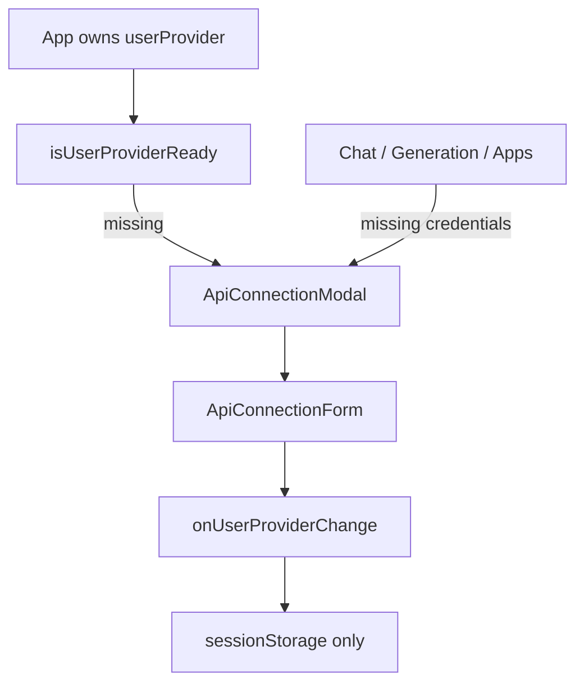

# Phase 01 - API Connection Modal Architecture

## Overview

- Priority: High
- Status: Completed
- Purpose: Replace full-page API settings navigation with a global modal that appears when API URL/Key are missing.

## Requirements

- On public app boot, detect `isUserProviderReady(userProvider)`.
- If not ready, open an API config modal automatically.
- Modal must collect API URL and API Key.
- Modal must reuse current provider presets and validation rules.
- Save only through existing `sessionStorage` path.
- Do not send URL/Key to admin APIs or public bootstrap.
- Allow user to close modal only after valid config, or keep app visible but blocked from model calls.

## Related Code Files

- Modify: `C:\Users\56252\Documents\New project 2\src\App.tsx`
  - Own modal open state.
  - Open modal on public boot when config is missing.
  - Pass `onRequestApiConfig` to shell/router.
- Create: `C:\Users\56252\Documents\New project 2\src\features\settings\ApiConnectionModal.tsx`
  - Dialog wrapper, focus management, save/cancel behavior.
- Create or modify: `C:\Users\56252\Documents\New project 2\src\features\settings\ApiConnectionForm.tsx`
  - Shared URL/Key form extracted from `UserSettingsModule`.
- Modify: `C:\Users\56252\Documents\New project 2\src\features\settings\UserSettingsModule.tsx`
  - Optional: reduce to wrapper around `ApiConnectionForm` or retire after Phase 02.
- Modify: `C:\Users\56252\Documents\New project 2\src\styles.css`
  - Add modal/scrim/form styles consistent with glass Rednote UI.

## Architecture

## Implementation Steps

1. Add `apiConfigOpen` state in `App`.
2. Add an effect:
   - only for non-admin route.
   - after bootstrap loading finishes.
   - if provider not ready, set modal open.
3. Create `ApiConnectionForm`.
   - Props: `userProvider`, `onUserProviderChange`, `onResetUserProvider`, `submitLabel`, `onSubmit`.
   - Keep `connectionPresets`, show/hide key, validation summary.
4. Create `ApiConnectionModal`.
   - Props: `open`, `required`, `userProvider`, change/reset handlers, close handler.
   - Use `role="dialog"` and `aria-modal="true"`.
   - If required and not ready, disable close button or show close as "稍后再说" only if product wants browsing without calls.
5. Wire modal into `App` below `AppShell`.
6. Keep BYOK boundary unchanged.

## Todo List

- [x] Extract API form.
- [x] Add modal component.
- [x] Add `App` modal state.
- [x] Open modal on missing config after public bootstrap.
- [x] Ensure no backend API receives URL/Key except chat/generation request bodies.

## Success Criteria

- Fresh session opens modal.
- Valid URL + Key closes modal.
- Reload in same tab keeps config from `sessionStorage` and does not reopen.
- New tab without session data opens modal again.
- Modal works on mobile width.

## Risks

- Bad focus behavior could trap keyboard incorrectly.
  - Mitigation: simple dialog, close/save buttons, focus first input.
- Existing settings page duplicates UI.
  - Mitigation: extract shared form first.

## Security Considerations

- Do not support API Key in query string by default. It leaks into history/logs.
- If "carry credentials by URL" becomes mandatory later, prefer hash fragment import, then immediately move to `sessionStorage` and clear hash.
