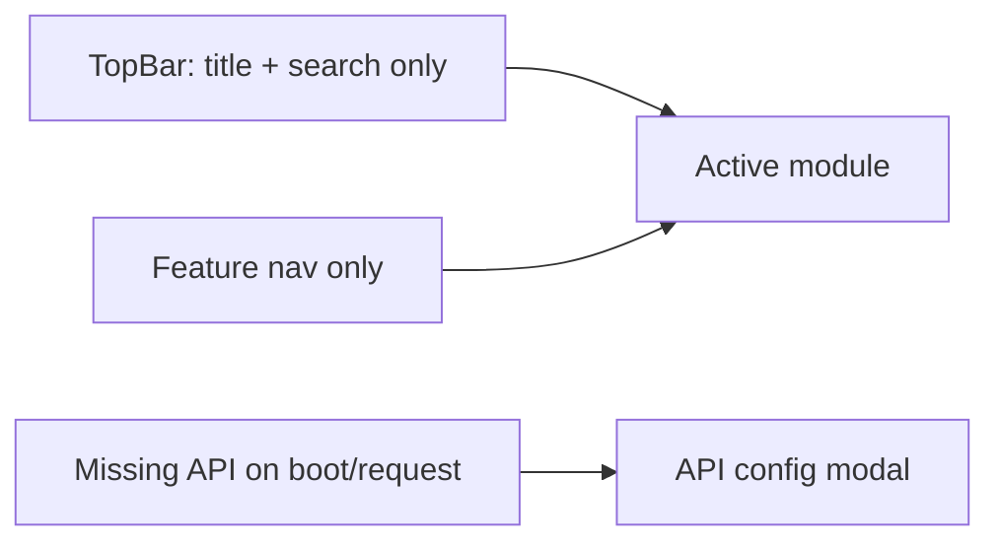

# Phase 02 - Public Chrome and Menu Cleanup

## Overview

- Priority: High
- Status: Completed
- Purpose: Remove persistent API configuration from the top-right chrome and stop treating API settings as a normal public menu item.

## Requirements

- Top bar must not always show "配置 API" / "API 已连接".
- Public nav should focus on product features: chat, image, audio, video, PPT, apps, agents, knowledge, mindmap, gallery, assistants.
- API config should open via modal on boot or when needed by a request.
- No admin link/menu in public shell.

## Related Code Files

- Modify: `C:\Users\56252\Documents\New project 2\src\app\AppShell.tsx`
  - Remove `connectionReady` prop if only used by `TopBar`.
  - Pass modal opener through router instead of settings navigation.
- Modify: `C:\Users\56252\Documents\New project 2\src\app\TopBar.tsx`
  - Remove `connectionReady` and `onNavigateSettings`.
  - Remove right-side `top-connection` button.
  - Rebalance grid layout so search remains polished.
- Modify: `C:\Users\56252\Documents\New project 2\src\app\LeftNav.tsx`
  - Exclude `settings` from normal nav rendering.
  - Remove `systemItems` footer if no visible system modules remain.
- Modify: `C:\Users\56252\Documents\New project 2\src\app\MobileNav.tsx`
  - Exclude `settings`.
- Modify: `C:\Users\56252\Documents\New project 2\src\app\ModuleRouter.tsx`
  - Replace settings route dependency with modal opener.
  - Keep `settings` fallback only if still needed for backwards compatibility.
- Modify: `C:\Users\56252\Documents\New project 2\server\index.mjs`
  - Change default menu so `settings` is not visible, or remove it from default public menu.
- Modify: `C:\Users\56252\Documents\New project 2\src\styles.css`
  - Remove or leave harmless `.top-connection` styles.
  - Adjust `.top-bar` columns for two elements instead of three.

## Architecture

## Implementation Steps

1. Update `TopBarProps`.
   - Remove `connectionReady`.
   - Remove `onNavigateSettings`.
   - Delete button JSX.
2. Update `AppShellProps`.
   - Remove `connectionReady`.
   - Do not pass settings navigation into `TopBar`.
3. Update nav filtering.
   - Exclude `settings` from `LeftNav` and `MobileNav`.
   - Prefer filtering in `App.visibleMenuItems` so every nav receives already-clean items.
4. Update default menu in server.
   - Set `settings.visible = false` or remove from default public menu.
   - Keep type until Phase 03/cleanup confirms no admin metadata issue.
5. Update feature modules.
   - Rename prop from `onNavigateSettings` to `onRequestApiConfig`.
   - Missing config should call modal opener.
6. Keep user-facing copy clear:
   - Missing config: "请先填写 API URL 和 Key".
   - Admin model missing: "请联系管理员启用模型" or "后台未启用可用模型".

## Todo List

- [x] Remove top-right API button.
- [x] Filter settings from public menus.
- [x] Update module missing-config actions to open modal.
- [x] Update server default menu visibility.
- [x] Remove stale styles if they cause layout drift.

## Success Criteria

- Desktop top-right no longer shows persistent API config state.
- Mobile nav no longer shows API settings.
- Left nav no longer shows API settings.
- Missing API config still has a clear path through modal.
- Ready API config does not create persistent public chrome.

## Risks

- Users may need to change API Key after initial entry.
  - Mitigation: modules can expose a non-persistent "更换 API" action only in local connection/error panels, not global chrome.
- Admin-configured menu may still include `settings`.
  - Mitigation: hard-filter `settings` in public UI even if old data has it visible.
